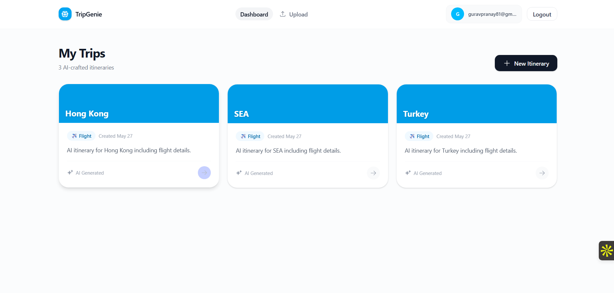
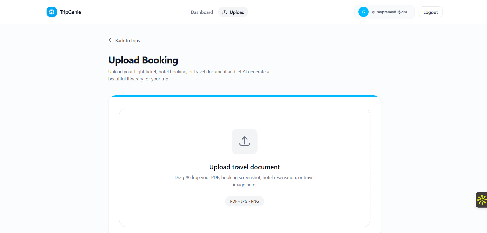
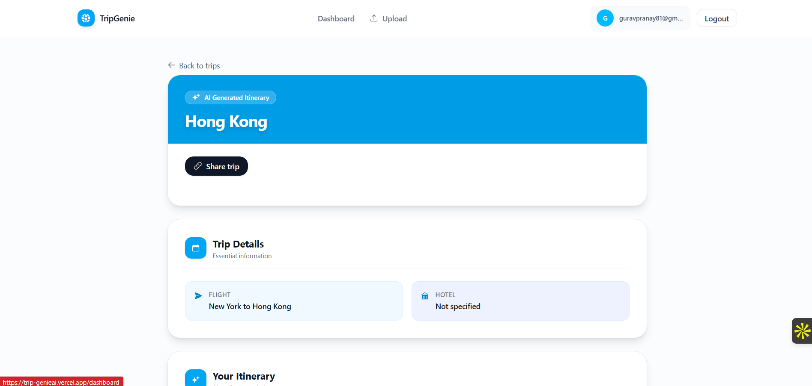

# 🌍 TripGenie - AI-Powered Travel Itinerary Generator

<div align="center">


**Transform your travel documents into personalized itineraries with AI**

[](https://opensource.org/licenses/MIT)
[](https://nodejs.org/)
[](https://reactjs.org/)
[](https://www.mongodb.com/)


</div>

---

## 📖 Overview

**TripGenie** is an intelligent travel planning application that leverages AI to automatically generate detailed, personalized travel itineraries from your booking documents. Simply upload your flight tickets, hotel reservations, or travel documents, and let our AI create a comprehensive day-by-day travel plan with recommendations for activities, dining, and local transportation.

### ✨ Key Highlights

- 🤖 **AI-Powered**: Uses Google Gemini AI for intelligent itinerary generation
- 📄 **Multi-Format Support**: Upload PDFs, images (JPG, PNG) of travel documents
- 🔍 **OCR Technology**: Extracts text from images using Tesseract.js
- 📱 **Responsive Design**: Beautiful, modern UI built with React and Tailwind CSS
- 🔐 **Secure Authentication**: JWT-based user authentication
- 🔗 **Shareable Itineraries**: Generate unique share links for your trips
- 💾 **Trip Management**: Save and manage all your itineraries in one place

---

## 🎯 Features

### Core Features

#### 1. **Document Upload & Processing**
- Support for PDF, JPG, and PNG formats
- Automatic text extraction using OCR (Optical Character Recognition)
- PDF parsing for booking confirmations
- Drag-and-drop interface for easy uploads

#### 2. **AI Itinerary Generation**
- Powered by Google Gemini AI (Flash Lite model)
- Extracts structured travel data (destination, dates, hotel, flight)
- Generates day-wise travel plans with:
  - Morning, afternoon, and evening activities
  - Food and dining recommendations
  - Local transportation suggestions
  - Hotel check-in/check-out reminders
  - Important travel tips

#### 3. **User Dashboard**
- View all your saved itineraries
- Beautiful card-based layout with color-coded destinations
- Quick access to trip details
- Search and filter capabilities

#### 4. **Itinerary Details**
- Comprehensive trip information display
- Markdown-formatted itinerary with rich formatting
- Shareable link generation
- Copy-to-clipboard functionality

#### 5. **Authentication & Security**
- User registration and login
- JWT token-based authentication
- Secure password hashing with bcrypt
- Protected routes and API endpoints

#### 6. **Share Functionality**
- Generate unique share IDs for each itinerary
- Public share pages (no login required)
- Beautiful presentation for shared trips

---

## 🚀 Demo

### Screenshots

#### Dashboard

*Manage all your trips in one beautiful interface*

#### Upload Document

*Drag and drop your travel documents*

#### AI-Generated Itinerary

*Detailed, personalized travel plans*

---

## 🛠️ Tech Stack

### Frontend
- **React 19.2.6** - Modern UI library
- **React Router 7.15.1** - Client-side routing
- **Tailwind CSS 4.3.0** - Utility-first CSS framework
- **Vite 8.0.12** - Fast build tool and dev server
- **Axios 1.16.1** - HTTP client
- **React Dropzone 15.0.0** - File upload component
- **React Markdown 10.1.0** - Markdown rendering
- **Framer Motion 12.40.0** - Animation library
- **React Hot Toast 2.6.0** - Toast notifications

### Backend
- **Node.js** - JavaScript runtime
- **Express 5.2.1** - Web application framework
- **MongoDB 9.6.2** - NoSQL database
- **Mongoose** - MongoDB object modeling
- **JWT (jsonwebtoken 9.0.3)** - Authentication
- **bcryptjs 3.0.3** - Password hashing
- **Multer 2.1.1** - File upload middleware
- **Tesseract.js 7.0.0** - OCR engine
- **pdf-parse 1.1.1** - PDF text extraction
- **Google Generative AI 0.24.1** - Gemini AI integration
- **CORS 2.8.6** - Cross-origin resource sharing
- **dotenv 17.4.2** - Environment variable management

---

## 📦 Installation

### Prerequisites

- **Node.js** (v18 or higher)
- **MongoDB** (local or cloud instance)
- **Google Gemini API Key** ([Get it here](https://makersuite.google.com/app/apikey))

### Step 1: Clone the Repository

```bash
git clone https://github.com/yourusername/tripgenie.git
cd tripgenie
```

### Step 2: Backend Setup

```bash
cd Backend
npm install
```

Create a `.env` file in the `Backend` directory:

```env
PORT=5000
MONGO_URI=mongodb://localhost:27017/tripgenie
JWT_SECRET=your_super_secret_jwt_key_here
GEMINI_API_KEY=your_gemini_api_key_here
```

### Step 3: Frontend Setup

```bash
cd ../Frontend
npm install
```

### Step 4: Start the Application

**Terminal 1 - Backend:**
```bash
cd Backend
npm run dev
```

**Terminal 2 - Frontend:**
```bash
cd Frontend
npm run dev
```

The application will be available at:
- **Frontend**: http://localhost:5173
- **Backend**: http://localhost:5000

---

## 📚 Usage

### 1. Register/Login
- Create a new account or login with existing credentials
- Secure JWT-based authentication

### 2. Upload Travel Document
- Navigate to the Upload page
- Drag and drop or click to upload your travel document
- Supported formats: PDF, JPG, PNG
- Examples: Flight tickets, hotel bookings, travel confirmations

### 3. AI Processing
- The system extracts text from your document
- AI analyzes and structures the travel data
- Generates a comprehensive itinerary

### 4. View & Manage
- Access your itinerary from the dashboard
- View detailed day-by-day plans
- Share with friends and family using the share link

### 5. Share Your Trip
- Click "Copy link" on any itinerary
- Share the link with anyone
- Recipients can view without logging in

---

## 🔌 API Documentation

### Authentication Endpoints

#### Register User
```http
POST /api/auth/register
Content-Type: application/json

{
  "name": "John Doe",
  "email": "john@example.com",
  "password": "securepassword123"
}
```

#### Login User
```http
POST /api/auth/login
Content-Type: application/json

{
  "email": "john@example.com",
  "password": "securepassword123"
}
```

### Upload Endpoints

#### Upload Document
```http
POST /api/upload
Authorization: Bearer <token>
Content-Type: multipart/form-data

document: <file>
```

### Itinerary Endpoints

#### Get User Itineraries
```http
GET /api/itineraries
Authorization: Bearer <token>
```

#### Get Single Itinerary
```http
GET /api/itineraries/:id
Authorization: Bearer <token>
```

#### Get Shared Itinerary
```http
GET /api/itineraries/share/:shareId
```

---

## 🏗️ Project Structure

```
tripgenie/
├── Backend/
│   ├── src/
│   │   ├── controllers/
│   │   │   ├── authController.js
│   │   │   ├── itineraryController.js
│   │   │   └── uploadController.js
│   │   ├── middleware/
│   │   │   ├── authMiddleware.js
│   │   │   └── uploadMiddleware.js
│   │   ├── models/
│   │   │   ├── User.js
│   │   │   └── Itinerary.js
│   │   ├── routes/
│   │   │   ├── authRoutes.js
│   │   │   ├── itineraryRoutes.js
│   │   │   └── uploadRoutes.js
│   │   ├── services/
│   │   │   ├── geminiService.js
│   │   │   ├── ocrService.js
│   │   │   └── pdfService.js
│   │   ├── utils/
│   │   │   └── generateToken.js
│   │   ├── uploads/
│   │   └── app.js
│   ├── server.js
│   ├── package.json
│   └── .env
│
├── Frontend/
│   ├── src/
│   │   ├── api/
│   │   │   └── axios.js
│   │   ├── components/
│   │   │   └── Navbar.jsx
│   │   ├── context/
│   │   │   └── AuthContext.jsx
│   │   ├── pages/
│   │   │   ├── Dashboard.jsx
│   │   │   ├── ItineraryDetail.jsx
│   │   │   ├── Login.jsx
│   │   │   ├── Register.jsx
│   │   │   ├── SharePage.jsx
│   │   │   └── Upload.jsx
│   │   ├── routes/
│   │   │   └── ProtectedRoute.jsx
│   │   ├── App.jsx
│   │   ├── main.jsx
│   │   └── index.css
│   ├── public/
│   ├── index.html
│   ├── package.json
│   └── vite.config.js
│
└── README.md
```

---

## 🔐 Environment Variables

### Backend (.env)

| Variable | Description | Example |
|----------|-------------|---------|
| `PORT` | Server port | `5000` |
| `MONGO_URI` | MongoDB connection string | `mongodb://localhost:27017/tripgenie` |
| `JWT_SECRET` | Secret key for JWT tokens | `your_secret_key` |
| `GEMINI_API_KEY` | Google Gemini API key | `AIza...` |

---

## 🧪 Testing

### Run Backend Tests
```bash
cd Backend
npm test
```

### Run Frontend Tests
```bash
cd Frontend
npm test
```

---

## 🚢 Deployment

### Backend Deployment (Heroku/Railway/Render)

1. Set environment variables in your hosting platform
2. Deploy the Backend folder
3. Ensure MongoDB is accessible

### Frontend Deployment (Vercel/Netlify)

1. Build the frontend:
```bash
cd Frontend
npm run build
```

2. Deploy the `dist` folder to your hosting platform
3. Update API base URL in `Frontend/src/api/axios.js`

---

## 🤝 Contributing

We welcome contributions! Please follow these steps:

1. Fork the repository
2. Create a feature branch (`git checkout -b feature/AmazingFeature`)
3. Commit your changes (`git commit -m 'Add some AmazingFeature'`)
4. Push to the branch (`git push origin feature/AmazingFeature`)
5. Open a Pull Request

### Contribution Guidelines

- Follow the existing code style
- Write clear commit messages
- Add tests for new features
- Update documentation as needed

---

## 📝 License

This project is licensed under the MIT License - see the [LICENSE](LICENSE) file for details.

---

## 👥 Authors

- **Your Name** - *Initial work* - [YourGitHub](https://github.com/yourusername)

---

## 🙏 Acknowledgments

- Google Gemini AI for powerful language models
- Tesseract.js for OCR capabilities
- The React and Node.js communities
- All contributors and supporters

---

=

---

## 🗺️ Roadmap

- [ ] Multi-language support
- [ ] Mobile app (React Native)
- [ ] Integration with booking platforms
- [ ] Real-time collaboration on itineraries
- [ ] Weather integration
- [ ] Budget tracking
- [ ] Offline mode
- [ ] Export to PDF/Calendar

---

---


